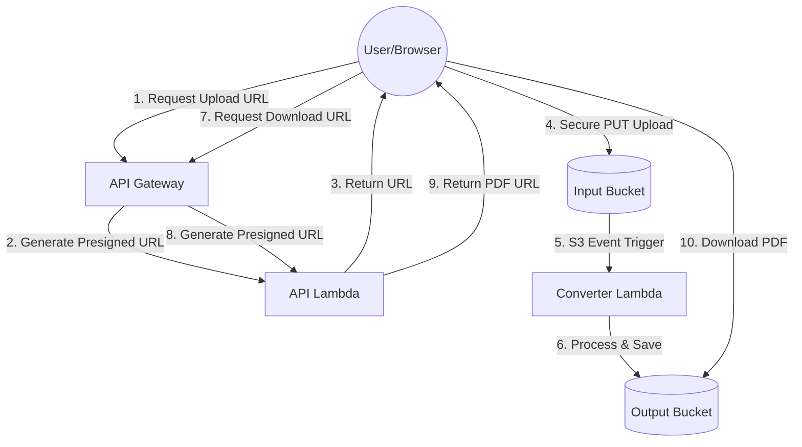

# AWS Serverless Doc-to-PDF Converter

A production-grade, asynchronous document conversion application built with AWS Lambda, S3, API Gateway, and Terraform.

## 🌟 Overview
This project allows users to upload documents (`.txt`, `.docx`, `.html`) through a modern web interface and receive a converted `.pdf` file in seconds. It uses the **Presigned URL pattern** to ensure secure, high-performance file transfers without the overhead of traditional API payloads.

---

## 🏗️ Architecture



### Core Components
-   **Frontend:** A responsive Single Page Application (Vanilla JS/CSS) hosted on S3.
-   **API Gateway (HTTP API):** Provides secure endpoints for obtaining S3 access.
-   **AWS Lambda (Python 3.9):**
    -   `api_upload`: Generates cryptographically signed S3 URLs for uploads.
    -   `api_download`: Generates signed URLs for secure result retrieval.
    -   `s3_processor`: The conversion engine using `fpdf2` and `python-docx`.
-   **Amazon S3:** Two buckets for isolation (Input/Output) with CORS and Public Access configurations.
-   **Infrastructure as Code:** Fully managed via **Terraform**.

---

## 🚀 Key Technical Features
-   **Asynchronous Processing:** Users don't wait for the conversion on the same request, preventing API timeouts.
-   **Presigned URLs:** Allows the browser to upload large files directly to S3, bypassing API Gateway's 10MB limit.
-   **Cross-Platform Packaging:** Custom build script (`build.ps1`) ensures Linux-compatible Python binaries are used regardless of your development OS.
-   **Custom Domain Support:** Integrated with AWS Certificate Manager (ACM) for professional branding (`lambda.abilashnimmala.in`).

---

## 🛠️ Local Setup & Deployment

### Prerequisites
-   AWS CLI configured with appropriate permissions.
-   Terraform installed.
-   Python 3.9+ installed.

### 1. Build the Lambda Package
Since the Lambda needs external libraries, we must package them for Linux:
```powershell
./build.ps1
```

### 2. Deploy Infrastructure
```bash
cd terraform
terraform init
terraform apply -auto-approve
```

### 3. Update Frontend
1.  Copy the `api_endpoint` from the Terraform output.
2.  Paste it into the `API_BASE` variable in `index.html`.
3.  Upload the frontend to your website bucket:
    ```bash
    aws s3 cp index.html s3://<your-output-bucket-name>/index.html
    ```

---

## 🌍 Custom Domain (GoDaddy)
To use your own domain like `lambda.abilashnimmala.in`:
1.  **ACM Certificate:** Terraform requests this. You must add the `CNAME` record provided in the Terraform output to your GoDaddy DNS.
2.  **CNAME Routing:** Add a `CNAME` record in GoDaddy pointing `lambda` to the `api_gateway_target_domain` output.

---

## 📝 Document Processing Logic
-   **TXT:** Direct mapping to FPDF cells with Unicode cleaning.
-   **DOCX:** Paragraph extraction and cleanup of non-Latin characters before PDF rendering.
-   **HTML:** Basic tag rendering using FPDF's `write_html` engine.

---

## 👨‍💻 Developer
**Abilash Nimmala**  
[GitHub Profile](https://github.com/your-username)
